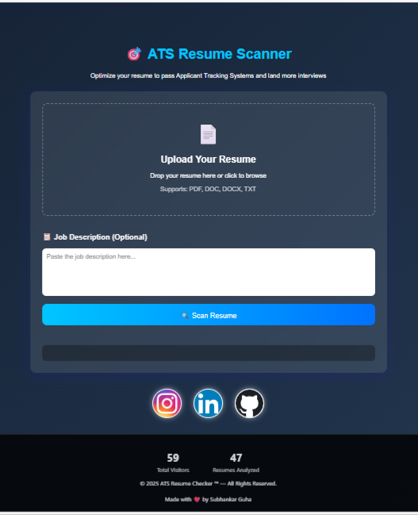
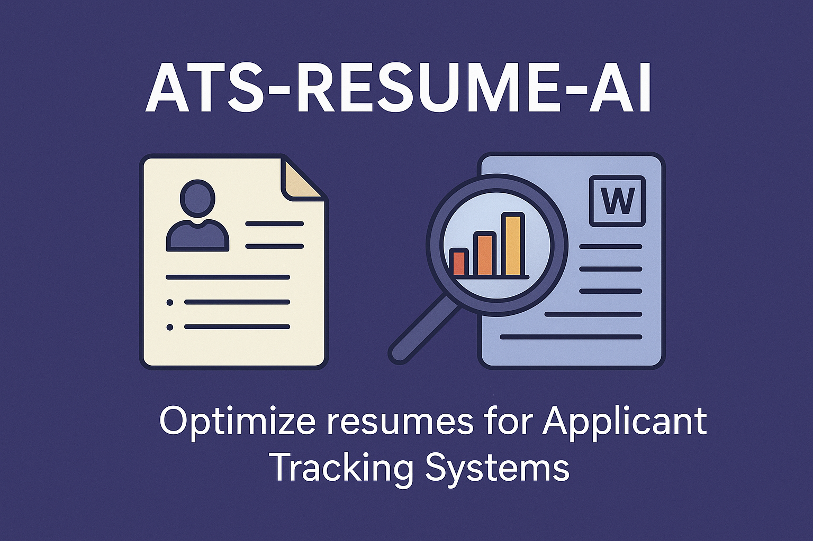

# ATS-Resume-AI

An AI-powered tool to help job-seekers optimize their resumes for Applicant Tracking Systems (ATS).  
Upload your resume, analyze how well it matches with job descriptions, and get actionable insights to improve your chances of getting past the first screen.

---

## 🚀 Live Demo  
 
👉 [Try it now - https://ats-resume-scanner.netlify.app](https://ats-resume-scanner.netlify.app) 

---

## 🖼️ Preview  

  

  
  

  

---

## 🧩 Features
- 📄 Resume upload (PDF/Word)  
- 🔍 Match your resume against job descriptions  
- 📊 Score and feedback on formatting, keywords, skills, etc.  
- 💡 Suggest improvements to boost ATS compatibility  
- 🧠 Optionally: AI-generated enhancements or summaries  

---

## 🛠️ Built With
- **Python** (backend logic)  
- **Streamlit / Flask / FastAPI** (web app framework)  
- **HTML5, CSS3, JavaScript** (frontend)  
- **AI / NLP models** (for keyword extraction, similarity matching)  

---

👤 Author

Subhankar Guha  
🔗 GitHub Profile - https://github.com/Sguha77

---

  

---
⭐ If you like this project, please give it a star on GitHub!

  
  &nbsp;&nbsp;&nbsp;
  
